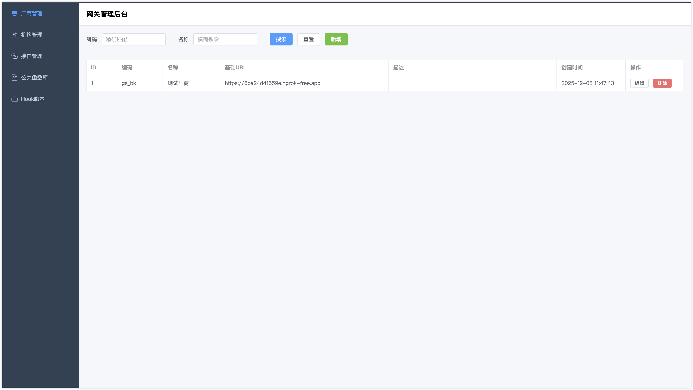
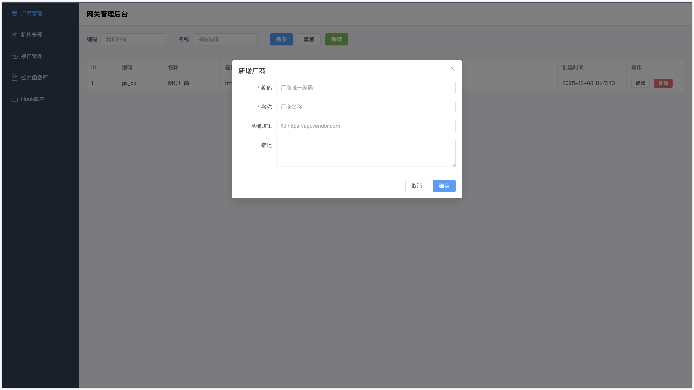
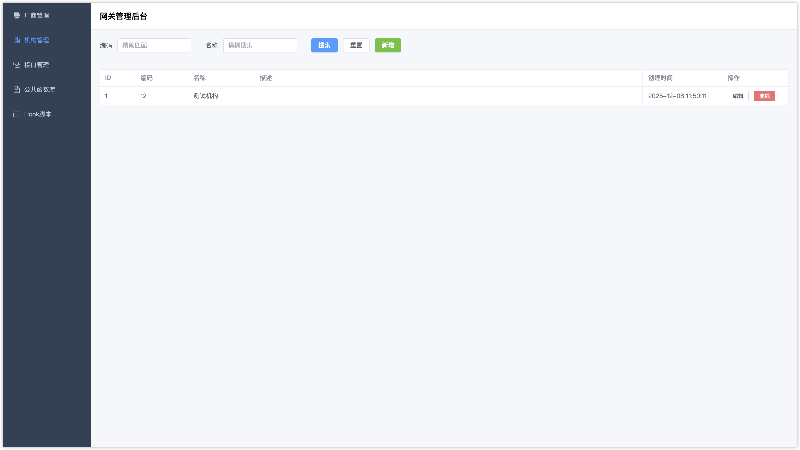
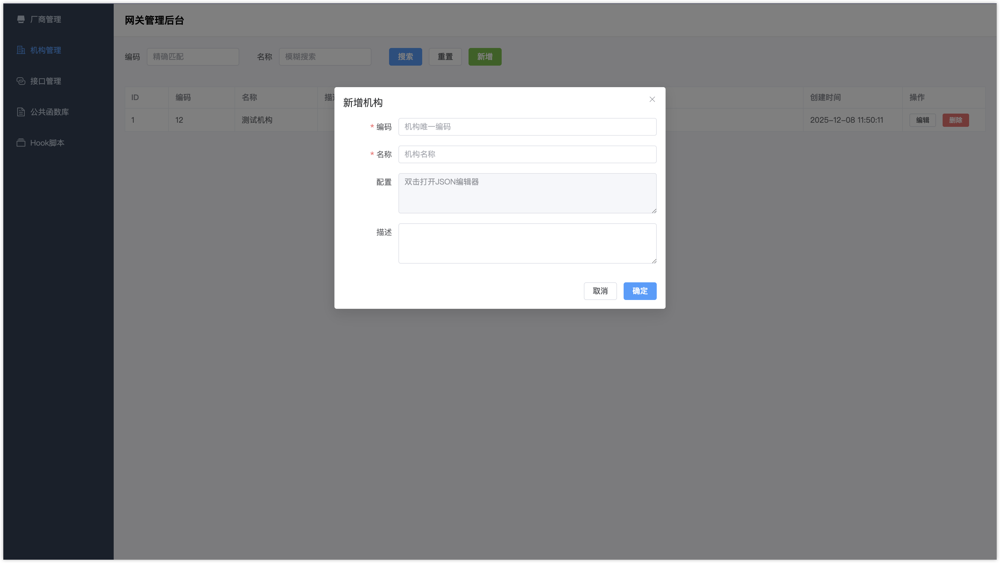
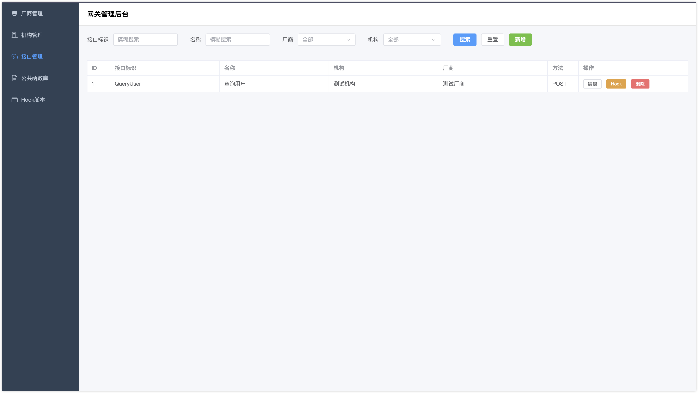
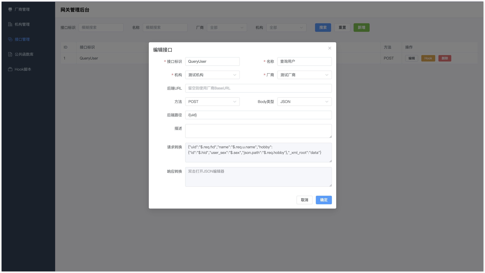
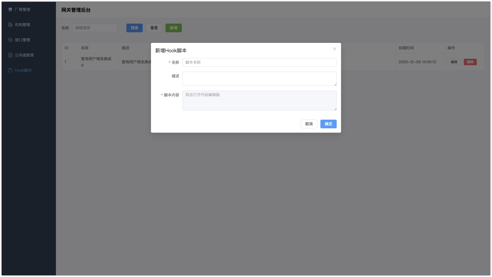
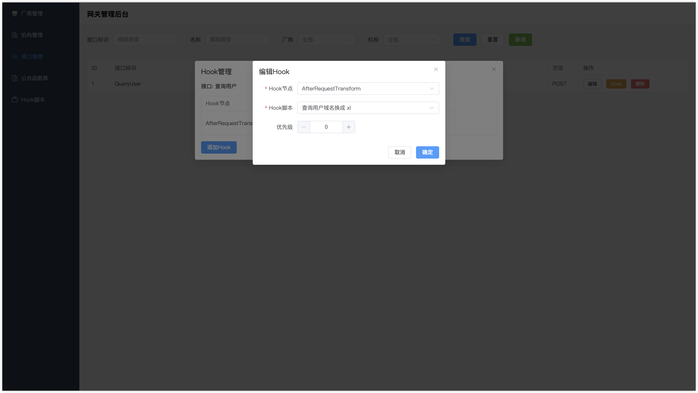
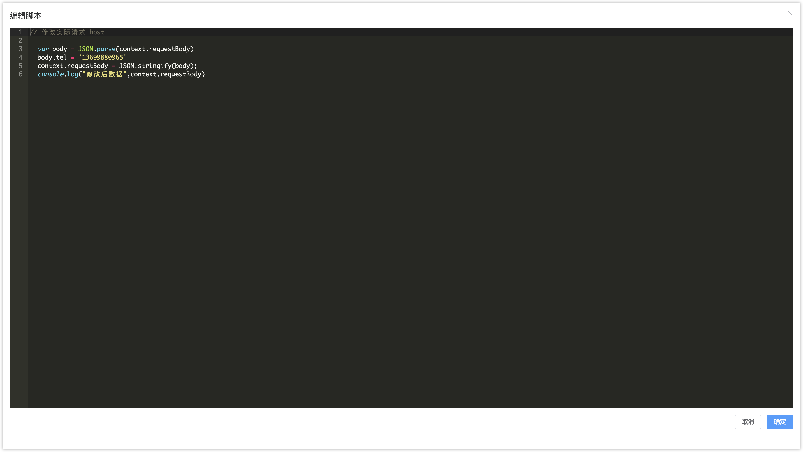
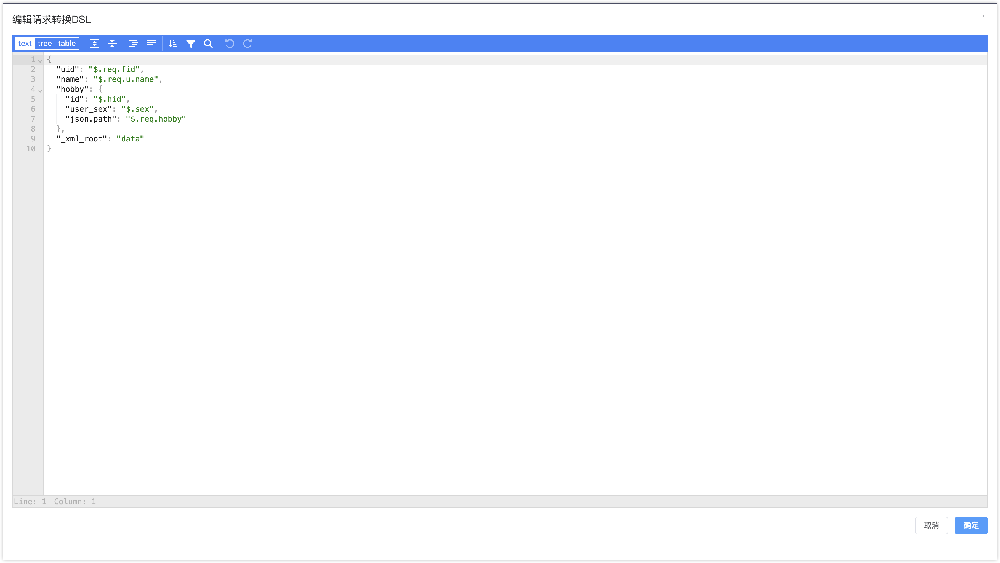

<div align="center">

# Gateway

**轻量级 API 网关 - 外部接口统一对接平台**

[简体中文](./readme.md) | [English](./readme_en.md)

[](https://go.dev/)
[](https://opensource.org/licenses/Apache-2.0)

</div>

---

## 这是什么？

Gateway 是一个**外部接口统一对接平台**，帮助你将多个外部厂商的不同接口格式，转换为内部统一的业务接口。

**核心价值：** 无论外部厂商接口格式如何变化，内部业务系统只需调用统一的网关接口，由网关负责协议转换、数据映射和接口适配。

## 使用场景

```
┌─────────────────┐     ┌─────────────┐     ┌─────────────────┐
│   内部业务系统    │────▶│   Gateway   │────▶│   外部厂商接口    │
│  (统一调用格式)   │◀────│   (转换层)   │◀────│  (各种不同格式)   │
└─────────────────┘     └─────────────┘     └─────────────────┘
```

**典型场景：**
- 对接多家支付渠道，内部统一支付接口
- 对接多家物流公司，内部统一物流查询接口
- 对接多家短信服务商，内部统一短信发送接口
- 对接多家银行接口，内部统一金融服务接口

## 核心功能

- 🔄 **协议转换** - 自动转换请求/响应格式，支持 JSON、Form、XML
- 📝 **DSL 映射** - 声明式字段映射，无需编码即可完成数据转换，支持 JSONPath 查询
- 🪝 **Hook 扩展** - JavaScript 脚本处理签名、加密、Token 获取等复杂逻辑
  - 内置加密库（MD5、SHA、HMAC、AES、DES、RSA）
  - HTTP 客户端（GET、POST、自定义请求）
  - 编码工具（Base64、Hex、JSON、XML、URL）
- 🏢 **多租户** - 厂商/机构/接口三层架构，灵活管理多方对接关系
- 🎨 **可视化管理** - Web 界面配置，无需重启即可生效
  - 专业的 JavaScript 编辑器（语法高亮、代码提示）
  - 可视化 JSON 编辑器（结构化编辑 DSL 映射）
- ⚡ **高性能** - 基于 Atreugo (FastHTTP)，JavaScript VM 池化并发安全
- 🔐 **灵活认证** - 支持自定义认证 Hook，适配各种鉴权方式

## 快速开始

### 环境要求

- Go 1.21+
- MySQL 5.7+

### 安装运行

**后端服务：**

```bash
# 克隆项目
git clone https://github.com/yourusername/gateway.git

# 配置数据库
# 编辑 backend/config.yaml 或设置环境变量
# 确保 MySQL 已安装并创建数据库

# 编译运行
cd gateway/backend
go build -o gateway .
./gateway
```

**前端管理界面：**

```bash
cd gateway/front
npm install
npm run dev    # 开发模式
npm run build  # 生产构建
```

**配置说明：**

创建 `backend/config.yaml` 或使用环境变量：

```yaml
port: :8080
adminToken: your-admin-token-here
database:
  host: localhost
  port: 3306
  user: root
  password: your-password
  database: gateway
  maxIdleConns: 10
  maxOpenConns: 100
logging:
  file: ./logs/gateway.log
  level: info
vmpool:
  size: 100  # JavaScript VM 池大小
```

### 调用示例

内部系统统一调用格式：

```bash
POST /gateway/v1/invoke
Content-Type: application/json

{
  "com_id": "alipay",           # 厂商编码
  "unit_id": "org001",          # 机构编码
  "service_id": "pay",          # 接口标识
  "biz_no": "BIZ20231201001",   # 业务流水号
  "req": {                      # 业务参数（统一格式）
    "amount": 100,
    "order_no": "ORDER001"
  }
}
```

网关自动将请求转换为厂商要求的格式，并将响应转换回统一格式返回。

## 工作原理

### 数据模型

| 实体 | 说明 | 示例 |
|------|------|------|
| **厂商 (Vendor)** | 外部接口提供方 | 支付宝、微信、银联 |
| **机构 (Organization)** | 内部使用方，存储对接配置 | 总部、分公司A、分公司B |
| **接口 (Service)** | 具体的接口配置和转换规则 | 支付、退款、查询 |

### 请求流程

```
请求 → 认证Hook → 请求转换(DSL) → BeforeForward Hook → 转发厂商
     ↓
返回 ← 响应转换(DSL) ← AfterForward Hook ← 厂商响应
```

**Hook 执行点：**
- **OnAuth** - 认证鉴权
- **BeforeForward** - 转发前处理（签名、Token 等）
- **AfterForward** - 响应后处理（数据清洗、状态转换）
- **OnError** - 错误处理

### DSL 转换示例

将内部统一格式转换为厂商格式：

```json
{
  "out_trade_no": "$.req.order_no",
  "total_amount": "$.req.amount",
  "timestamp": "@ctx.timestamp",
  "sign": "@ctx.sign"
}
```

### Hook 脚本示例

处理签名等复杂逻辑：

```javascript
// BeforeForward - 添加签名
var body = JSON.parse(ctx.request.body);
body.sign = crypto.md5(body.data + ctx.data.org_config.secret);
ctx.request.body = JSON.stringify(body);

// 或使用 HMAC
body.sign = crypto.hmacSha256(body.data, ctx.data.org_config.secret);

// RSA 签名
body.sign = crypto.rsaSign(body.data, ctx.data.org_config.privateKey, 'SHA256');

// 获取 Access Token
var tokenResp = http.post('https://api.vendor.com/token', {
  app_id: ctx.data.org_config.appId,
  secret: ctx.data.org_config.secret
});
var token = JSON.parse(tokenResp.body).access_token;
ctx.request.headers['Authorization'] = 'Bearer ' + token;
```

**内置函数库：**

| 模块 | 功能 |
|------|------|
| `crypto` | MD5、SHA1/256/512、HMAC、AES、DES、RSA 加密/解密/签名 |
| `http` | GET、POST、自定义 HTTP 请求 |
| `encoding` | Base64、Hex、JSON、XML、URL 编码/解码 |
| `util` | 时间戳、UUID 生成 |
| `console` | 日志输出（log、error、warn）|

## 界面截图

### 厂商管理



### 机构管理



### 接口管理



### Hook 管理



### 编辑器



## 项目结构

```
backend/                 # 后端服务
├── handler/            # HTTP 处理器
├── hook/               # Hook 系统 + 内置函数
├── model/              # 数据模型
├── transform/          # DSL 转换引擎
├── proxy/              # HTTP 代理
└── router/             # 路由注册

front/                   # 前端管理界面
└── src/
    ├── views/          # 页面
    └── components/     # 组件
```

## 技术栈

**后端：**
- **语言：** Go 1.21+
- **Web 框架：** Atreugo v11 (基于 FastHTTP 的高性能框架)
- **ORM：** GORM (MySQL 驱动)
- **JavaScript 引擎：** Goja (用于 Hook 脚本执行)
- **配置管理：** Viper
- **日志：** Zap (结构化日志)
- **JSON Path：** jsonpath (DSL 转换)

**前端：**
- **框架：** Vue 3
- **UI 库：** Element Plus 2.4+
- **路由：** Vue Router 4.2+
- **HTTP 客户端：** Axios
- **编辑器：**
  - Ace Editor (JavaScript 代码编辑器)
  - JSON Editor (可视化 JSON 编辑器)
- **构建工具：** Vite 5.0+

**数据库：**
- MySQL 5.7+ (支持自动迁移和连接池)

## 管理界面功能

### 厂商管理
- 新增/编辑/删除外部厂商
- 配置厂商基础信息（编码、名称、Base URL）
- 支持批量导入厂商配置

### 机构管理
- 管理内部使用方（总部、分公司等）
- 配置机构专属参数（appId、secret、证书等）
- 支持 JSON 格式的灵活配置存储

### 接口管理
- 可视化配置接口转换规则
- **JSON 编辑器**支持结构化编辑 DSL 映射
- 配置请求/响应转换规则
- 设置厂商后端路径和请求方法
- 关联 Hook 脚本到不同执行点

### Hook 脚本管理
- **JavaScript 编辑器**提供语法高亮和代码提示
- 编写可复用的 Hook 脚本
- 测试和调试脚本功能
- 脚本库管理（全局共享函数）

### 接口 Hook 关联
- 为接口绑定多个 Hook 脚本
- 配置 Hook 执行顺序和执行点
- 支持条件执行和参数传递

## 文档

- [📖 技术实现文档](./TECHNICAL.md) - 系统架构、核心模块、实现原理详解
- [📡 管理 API 参考](./ADMIN_API.md)
- [🔧 DSL Context 参考](./DSL_CONTEXT_REFERENCE.md)
- [💡 使用示例](./EXAMPLE.md)
- [🔒 并发安全](./CONCURRENCY_SAFETY.md)

## 特性亮点

### 🚀 高性能架构
- 基于 FastHTTP 的高性能 Web 框架
- JavaScript VM 池化技术，避免重复创建销毁
- 数据库连接池优化
- 并发安全设计

### 🎯 零代码配置
- 通过可视化界面完成所有配置
- DSL 声明式映射，无需编写转换代码
- Hook 脚本热加载，配置即时生效
- 无需重启服务

### 🔧 强大的扩展性
- JavaScript Hook 系统，支持复杂业务逻辑
- 内置丰富的加密、HTTP、编码工具库
- 支持自定义脚本库（全局共享函数）
- 灵活的执行点设计（认证、前置、后置、错误）

### 🏢 多租户支持
- 三层架构清晰分离职责
- 机构级配置隔离
- 支持同一厂商多机构对接
- 灵活的配置继承和覆盖

### 🛡️ 安全可靠
- 敏感信息加密存储
- 请求日志完整追踪
- 异常自动捕获和记录
- 支持自定义认证策略

## 使用流程

1. **配置厂商** - 在厂商管理界面添加外部 API 提供商
2. **配置机构** - 添加内部使用方，配置对接凭证（appId、secret 等）
3. **配置接口** - 创建接口，设置 DSL 映射规则
4. **编写 Hook（可选）** - 如需复杂逻辑（签名、Token），编写 Hook 脚本
5. **关联 Hook** - 将 Hook 脚本关联到接口的执行点
6. **调用测试** - 使用统一格式调用网关接口
7. **监控日志** - 查看请求日志，排查问题

## License

[Apache License 2.0](LICENSE)
